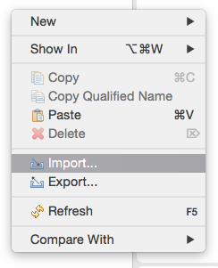
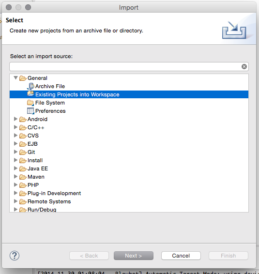
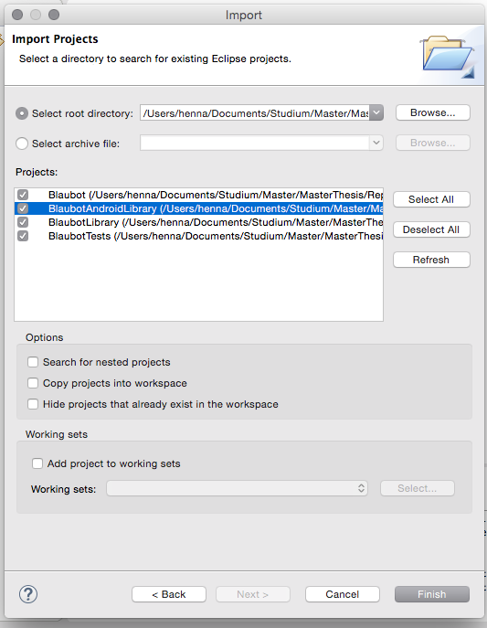
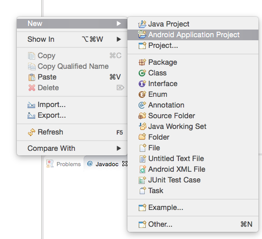
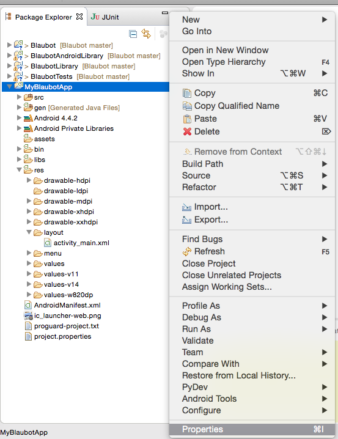
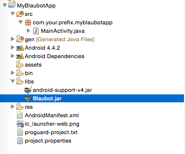
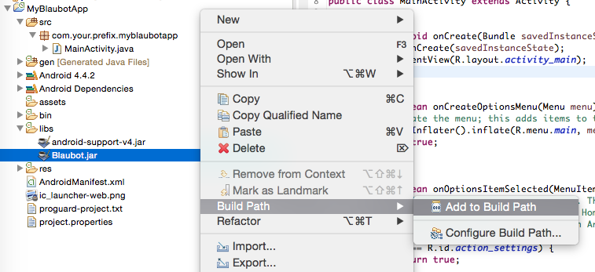
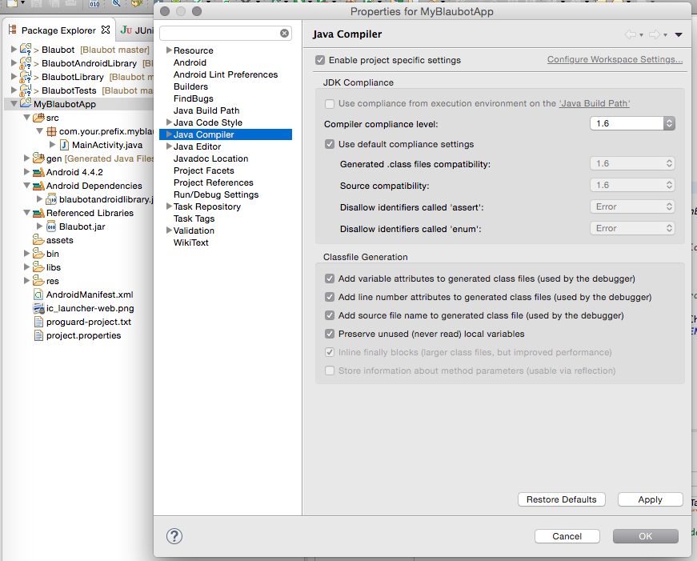

Blaubot
=======
Blaubot is a lightweight framework to form small networks via P2P connections such as Bluetooth-RFCOMM, Adhoc-WiFi or simple socket connections.
Blaubot takes care of device discovery and connection establishment with the goal to minimize a developer's boilerplate code to set up these small networks.

Tl;dr our main goal is to let a developer call start(); and spare him as much hassle as possible to create ad hoc networks.

Requirements Android
=======
Android 4.0.3 or higher

<a name="general_usage"></a>General Usage
=======
1) Obtain a Blaubot instance from a BlaubotFactory
```java
// Generate a UUID that is unique for your application
// see http://www.famkruithof.net/uuid/uuidgen
final UUID APP_UUID = UUID.fromString("ec127529-2e9c-4046-a5a5-144feb30465f"); 
Blaubot blaubot = BlaubotAndroidFactory.createEthernetBlaubot(APP_UUID);
```
2) (optional) Register a ILifecycleListener to the Blaubot instance
```java
blaubot.addLifecycleListener(new ILifecycleListener() {
			
	@Override
	public void onPrinceDeviceChanged(IBlaubotDevice oldPrince,	IBlaubotDevice newPrince) {
	    // if the network's king goes down, the prince will rule over the remaining peasants
	}
	
	@Override
	public void onDisconnected() {
	 	// THIS device disconnected from the network
	}
	
	@Override
	public void onDeviceLeft(IBlaubotDevice blaubotDevice) {
	  // ANOTHER device disconnected from the network
	}
	
	@Override
	public void onDeviceJoined(IBlaubotDevice blaubotDevice) {
	  // ANOTHER device connected to the network THIS device is on
	}
	
	@Override
	public void onConnected() {
	  // THIS device connected to a network
	  // onDeviceJoined(...) calls will follow for each OTHER device that was already connected
	}
	
});
```
3) Start Blaubot
```java
blaubot.startBlaubot();
```
4) Create a Channel 
```java
final short channelId = (short) 1;
final IChannel channel = blaubot.createChannel(channelId);
```
4.1) Send messages to all subscribers of this channel
```java
channel.post("Hello world!".getBytes(Charset.forName("UTF-8")));
```
4.2) Subscribe to the channel via channel.subsribe(<YourListener>) to receive messages
```java
channel.subscribe(new IMessageListener() {
	
	@Override
	public void onMessage(BlaubotMessage message) {
		// we got a message - our payload is a byte array
		// deserialize
		String msg = new String(message.getPayload(), Charset.forName("UTF-8"));
		// .. do something useful ..
	}
	
});
```

If you registered the listener in step 2, you will be informed if your own device or other devices join or leave a network.

Quickstart Java
=======
1. Get the General-JAR and add it to your project's dependencies.
2. Create a Blaubot instance using de.hsrm.blaubot.core.BlaubotFactory
```java
// creates a Blaubot instance with a multicast beacon on the first found local interface
de.hsrm.blaubot.core.BlaubotFactory.createEthernetBlaubot(APP_UUID);

// or create a Blaubot instance without multicast searching for a fixed set of devices by their ip addresses
de.hsrm.blaubot.core.BlaubotFactory.createEthernetBlaubotWithFixedDevices(...);
```

You can choose between a fixed set of devices to form net Blaubot network or to dynamically search and discover nearby running Blaubot instances via multicast from the Factory's methods. 
If your targeted environment supports multicasts, this should be the easiest option for you to get your app working.


Quickstart Android
=======

1) Import the BlaubotAndroidLibrary into your eclipse workspace:
1.1) Right click in the Package view -> Import


1.2) Choose import existing projects into Workspace


1.3) Import at least the BlaubotAndroidLibrary project


1.3) Create your project 


1.4) Right click the newly created project -> Properties


1.5) In the Android tab click add (bottom right) -> Select BlaubotAndroidLibrary -> Click ok
 -> Select BlaubotAndroidLibrary -> Click ok")

1.6) Copy the Blaubot.jar into the libs folder of YOUR project


1.7) Right click the jar and choose: Build Path -> Add to Build Path


1.8) Add the permissions to your AndroidManifest.xml (you can copy them from the Blaubot project's AndroidManifest.xml)
")

1.9) Attention: Ensure that you compile your project java 1.6 format compatible.


1.10) Add some blaubot code (see [General Usage](#general_usage))
)")


2) Create a Blaubot instance using de.hsrm.blaubot.android.BlaubotFactory
```java
// you can use the same ethernet based isntances as for java but additionally:

// creates a Blaubot instance using Android's Bluetooth API
de.hsrm.blaubot.android.BlaubotFactory.createBluetoothBlaubot(APP_UUID);
```

3) You are now ready to use Blaubot. Check the [General Usage](#general_usage) section how to use it.

On Android you can rely on the standard ethernet-based Blaubot (see Quickstart Java) but you can also use the Bluetooth-based Blaubot.
Please note that you have to use a different Factory to create Blaubot instances optimized for the Android platform.

Note that if you use Bluetooth, Blaubot will only find devices that are paired with each other. This means if you want to connect three devices, all of them need to be paired with the others.

We recommend to create a sticky [Android Service](http://developer.android.com/guide/components/services.html) to encapsulate the Blaubot instance.